<h1 align="center">
  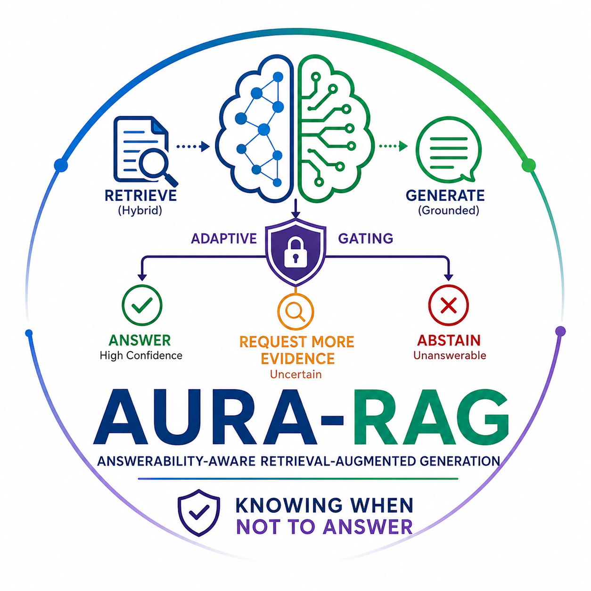
  Answerability-Aware RAG: Knowing When Not to Answer
</h1>

<p align="center">
  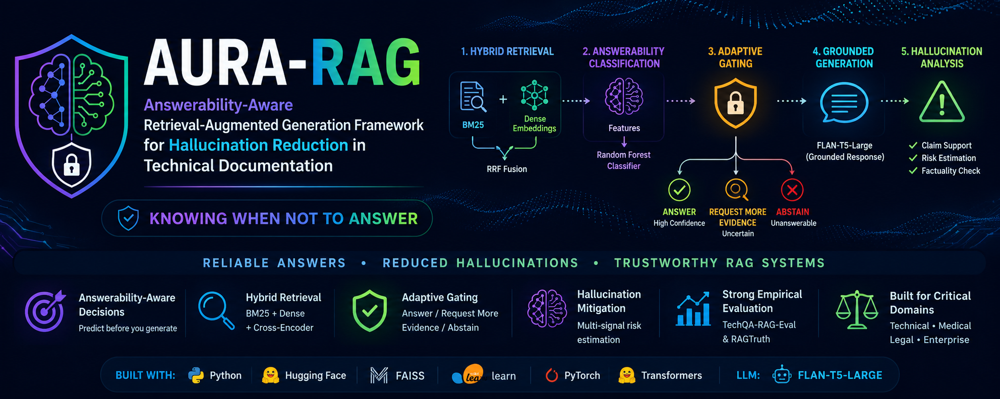
</p>

<p align="center">
<b>An Answerability-Aware Retrieval-Augmented Generation Framework for Reliable Question Answering and Hallucination Mitigation</b>
</p>

<p align="center">


</p>

---

# 📖 Overview

Large Language Models (LLMs) have significantly improved open-domain question answering, but they continue to suffer from **hallucinations**—responses that appear fluent and convincing despite being unsupported by evidence. Although Retrieval-Augmented Generation (RAG) enhances factual grounding by incorporating external knowledge, conventional RAG systems generally assume that retrieved documents always contain sufficient evidence to answer a question. Consequently, these systems often generate responses even when the available context is incomplete, ambiguous, or entirely irrelevant.

**Answerability-Aware RAG (AURA-RAG)** introduces an adaptive decision-making framework that determines **whether a question should be answered before response generation begins**. Rather than always producing an answer, the framework first evaluates the sufficiency of the retrieved evidence using a calibrated answerability classifier. Based on this assessment, the system dynamically selects one of three actions:

- ✅ **Generate a grounded answer**
- 🔍 **Request additional supporting evidence**
- 🛑 **Abstain from answering**

This answerability-aware decision process substantially reduces unsupported generations while improving the overall reliability, safety, and trustworthiness of Retrieval-Augmented Generation systems.

The framework combines:

- Hybrid Retrieval (BM25 + Dense Semantic Retrieval)
- Answerability Prediction
- Probability Calibration
- Adaptive Three-Way Decision Gating
- Grounded Response Generation
- Hallucination Risk Estimation
- LLM-as-a-Judge Evaluation
- Comprehensive Benchmarking on TechQA-RAG-Eval and RAGTruth

---

# 🎯 Motivation

Traditional Retrieval-Augmented Generation systems focus primarily on retrieving relevant documents and generating fluent responses. However, retrieval quality alone does not guarantee factual correctness. When supporting evidence is insufficient, conventional RAG pipelines frequently produce confident yet unsupported answers.

This project addresses a fundamental question:

> **"How can a Retrieval-Augmented Generation system determine when it should not answer?"**

Instead of maximizing answer coverage at any cost, the proposed framework prioritizes **reliability over response frequency** by explicitly modeling answerability before generation.

---

# ✨ Key Features

- 🔍 **Hybrid Retrieval**
  - BM25 lexical retrieval combined with dense semantic retrieval.

- 🧠 **Answerability Prediction**
  - Random Forest classifier estimates whether retrieved evidence is sufficient to answer a query.

- 📊 **Probability Calibration**
  - Isotonic Regression improves confidence estimation for more reliable decision making.

- 🚦 **Adaptive Three-Way Decision Gate**
  - Answer
  - Request More Evidence
  - Abstain

- 🤖 **Grounded Response Generation**
  - FLAN-T5-Large generates responses strictly conditioned on retrieved evidence.

- 🛡️ **Hallucination Risk Estimation**
  - Claim-level support verification using the RAGTruth benchmark.

- 📈 **Comprehensive Evaluation**
  - Retrieval Recall@5
  - ROC-AUC
  - BERTScore
  - ROUGE-L
  - Calibration Metrics
  - LLM-as-a-Judge
  - Ablation Study

- 📚 **Research-Oriented Documentation**
  - Complete methodology
  - Dataset documentation
  - Experimental evaluation
  - Quantitative and qualitative analyses

---

# 🖼️ Graphical Abstract

<p align="center">
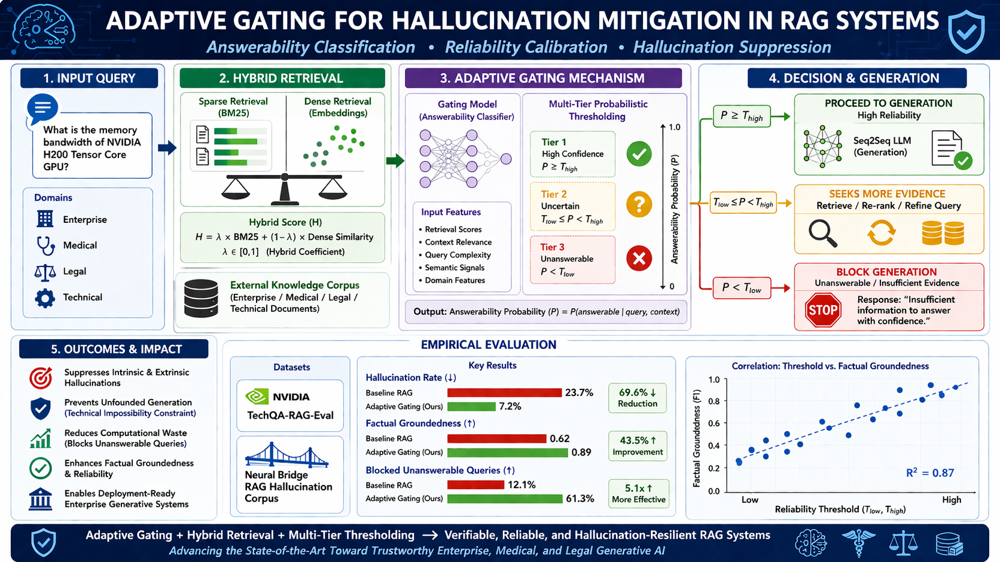
</p>

The proposed framework extends conventional Retrieval-Augmented Generation by introducing an **Answerability-Aware Decision Layer** between retrieval and generation. Instead of assuming that retrieved context always contains sufficient evidence, the system first evaluates answerability using retrieval-derived features and calibrated confidence estimation. Depending on the predicted confidence, the framework either generates a grounded response, requests additional evidence, or abstains from answering, thereby reducing hallucinations and improving factual reliability.

---

# 📑 Table of Contents

- [📖 Overview](#-overview)
- [🎯 Motivation](#-motivation)
- [✨ Key Features](#-key-features)
- [🖼️ Graphical Abstract](#️-graphical-abstract)
- [🏗️ System Architecture](#️-system-architecture)
- [⚙️ Workflow](#️-workflow)
- [📂 Repository Structure](#-repository-structure)
- [🚀 Installation](#-installation)
- [💻 Usage](#-usage)
- [🧩 Methodology](#-methodology)
- [📊 Datasets](#-datasets)
- [📈 Experimental Results](#-experimental-results)
- [📁 Documentation](#-documentation)
- [🏆 Key Findings](#-key-findings)
- [🛣️ Roadmap](#️-roadmap)
- [⚠️ Limitations](#️-limitations)
- [🔮 Future Work](#-future-work)
- [📖 Citation](#-citation)
- [📜 License](#-license)
- [🙏 Acknowledgements](#-acknowledgements)

---

# 🏗️ System Architecture

<p align="center">
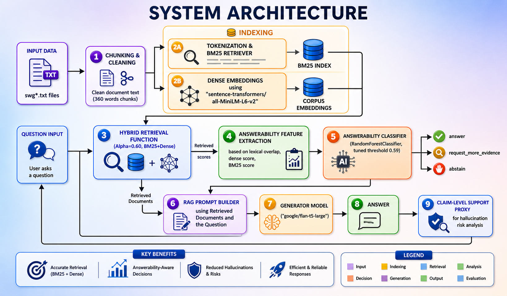
</p>

The proposed **Answerability-Aware Retrieval-Augmented Generation (AURA-RAG)** framework introduces a reliability-aware decision layer between retrieval and response generation. Rather than assuming that every retrieved context is sufficient for answering a question, the system evaluates the quality and completeness of the retrieved evidence before deciding whether generation should proceed.

The architecture consists of the following major components:

| Component | Description |
|-----------|-------------|
| **Hybrid Retrieval** | Retrieves relevant documents using a combination of BM25 lexical search and dense semantic retrieval. |
| **Answerability Feature Extraction** | Computes retrieval-derived features describing evidence quality and context sufficiency. |
| **Answerability Classifier** | Predicts the probability that the retrieved context is sufficient to answer the query. |
| **Probability Calibration** | Applies isotonic regression to improve confidence estimation. |
| **Adaptive Decision Gate** | Dynamically selects one of three actions: Answer, Request More Evidence, or Abstain. |
| **Grounded Response Generator** | Generates responses using FLAN-T5-Large conditioned solely on retrieved evidence. |
| **Hallucination Risk Analysis** | Evaluates claim-level grounding and estimates hallucination risk using RAGTruth. |
| **Evaluation Module** | Measures retrieval quality, answerability prediction, response quality, calibration, and hallucination mitigation. |

> 📖 A detailed description of the complete architecture is available in **[`docs/methodology.md`](docs/methodology.md)**.

---

# ⚙️ Workflow

<p align="center">
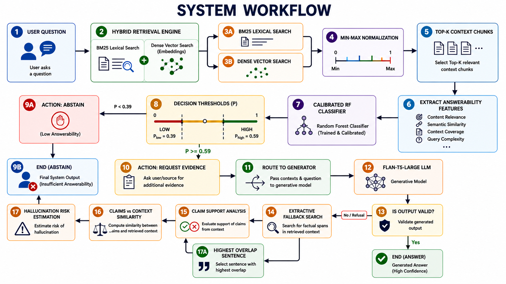
</p>

The end-to-end workflow consists of the following stages:

1. **User Query**
   - A natural language question is submitted to the system.

2. **Hybrid Retrieval**
   - BM25 retrieves lexically relevant documents.
   - Dense retrieval captures semantic similarity.
   - Retrieved results are combined into a unified evidence set.

3. **Feature Extraction**
   - Retrieval statistics and evidence quality indicators are computed.

4. **Answerability Prediction**
   - A calibrated Random Forest classifier estimates the probability that the available evidence can answer the query.

5. **Adaptive Decision Making**
   - Based on calibrated confidence, the system chooses one of three actions:
     - ✅ Generate Answer
     - 🔍 Request More Evidence
     - 🛑 Abstain

6. **Grounded Generation**
   - If sufficient evidence exists, FLAN-T5-Large generates a response conditioned on the retrieved context.

7. **Hallucination Analysis**
   - Generated responses undergo claim-level support verification and hallucination risk estimation.

8. **Evaluation**
   - The complete pipeline is evaluated using retrieval metrics, generation metrics, calibration analysis, hallucination benchmarks, and LLM-as-a-Judge assessment.

---

# 📂 Repository Structure

```text
Answerability-Aware-RAG/
│
├── README.md
├── LICENSE
├── .gitignore
├── requirements.txt
│
├── notebook/
│   └── answerability_relability_hallucination_using_rag.ipynb
│
├── docs/
│   ├── methodology.md
│   ├── datasets.md
│   └── evaluation.md
│
├── figures/
│   ├── overview/
│   ├── retrieval/
│   ├── answerability/
│   ├── end_to_end/
│   ├── generation_quality/
│   ├── hallucination/
│   ├── llm_judge/
│   ├── calibration/
│   └── ablation/
│
├── datasets/
│   ├── README.md
│   ├── techqa_rag_eval.md
│   ├── ragtruth.md
│   └── dataset_download_links.md
│
├── results/
│   ├── quantitative_results.md
│   └── qualitative_examples.md
│
└── assets/
    ├── logo.png
    └── banner.png
```

---

# 🚀 Installation

## 1️⃣ Clone the Repository

```bash
git clone https://github.com/Bijoy781999/Answerability-Aware-RAG__Knowing-When-Not-to-Answer.git

cd Answerability-Aware-RAG__Knowing-When-Not-to-Answer
```

---

## 2️⃣ Create a Virtual Environment (Recommended)

### Windows

```bash
python -m venv venv

venv\Scripts\activate
```

### Linux / macOS

```bash
python -m venv venv

source venv/bin/activate
```

---

## 3️⃣ Install Dependencies

```bash
pip install -r requirements.txt
```

---

## 4️⃣ Download the Benchmark Datasets

This repository does **not** include the datasets.

Download them using the instructions provided in:

- 📄 [`datasets/dataset_download_links.md`](datasets/dataset_download_links.md)

Supported datasets:

- NVIDIA TechQA-RAG-Eval
- RAGTruth

---

## 5️⃣ Launch Jupyter Notebook

```bash
jupyter notebook
```

Open

```text
notebook/
└── answerability_relability_hallucination_using_rag.ipynb
```

Run the notebook sequentially from top to bottom.

---

# 💻 Usage

The notebook implements the complete AURA-RAG pipeline, including:

- Data preprocessing
- Hybrid retrieval
- Answerability feature extraction
- Random Forest training
- Probability calibration
- Adaptive decision gating
- Grounded response generation
- Hallucination risk estimation
- Evaluation
- Visualization

The implementation is organized as a sequential research workflow, making it easy to reproduce the experiments described in this repository.

---

## 📋 Runtime Requirements

| Component | Recommended |
|-----------|-------------|
| Python | 3.10+ |
| RAM | 16 GB or higher |
| GPU | NVIDIA GPU (CUDA recommended) |
| VRAM | 12 GB+ (recommended for FLAN-T5-Large) |
| Storage | 10 GB+ free space |

Although the notebook can run on CPU, GPU acceleration is strongly recommended for model inference and evaluation.

---

## 📦 Core Libraries

The project is built using several open-source libraries, including:

- PyTorch
- Hugging Face Transformers
- Sentence Transformers
- FAISS
- Rank-BM25
- Scikit-learn
- Pandas
- NumPy
- Matplotlib
- BERTScore
- ROUGE
- Evaluate
- SciPy
- tqdm

For the complete dependency list, refer to:

```text
requirements.txt
```
---

# 🧩 Methodology

AURA-RAG extends the conventional Retrieval-Augmented Generation (RAG) pipeline by introducing an **Answerability-Aware Decision Layer** that evaluates whether the retrieved evidence is sufficient before generating a response.

Unlike traditional RAG systems that always attempt to answer a query, the proposed framework first estimates answerability using retrieval-derived features and calibrated confidence estimation. Based on the predicted confidence, the system dynamically chooses whether to:

- ✅ Generate a grounded response
- 🔍 Request additional supporting evidence
- 🛑 Abstain from answering

This adaptive decision mechanism significantly reduces hallucinations while improving the factual reliability and safety of generated responses.

The framework consists of five major stages:

| Stage | Description |
|--------|-------------|
| 🔍 Hybrid Retrieval | Retrieves relevant documents using BM25 and dense semantic retrieval. |
| 📊 Answerability Prediction | Estimates whether the retrieved evidence is sufficient to answer the query. |
| 🎯 Probability Calibration | Improves confidence estimation using isotonic regression. |
| 🤖 Grounded Generation | Generates responses conditioned solely on retrieved evidence using FLAN-T5-Large. |
| 🛡️ Hallucination Analysis | Estimates hallucination risk through claim-level support verification. |

> 📖 For a complete technical description of the proposed framework, see **[`docs/methodology.md`](docs/methodology.md)**.

---

# 📊 Datasets

The proposed framework is evaluated using two publicly available benchmark datasets that collectively assess retrieval effectiveness, answerability prediction, and hallucination detection.

| Dataset | Purpose |
|----------|---------|
| **TechQA-RAG-Eval** | Retrieval-Augmented Question Answering Benchmark |
| **RAGTruth** | Hallucination Detection and Reliability Analysis |

---

## NVIDIA TechQA-RAG-Eval

TechQA-RAG-Eval is an enterprise-scale benchmark designed for evaluating Retrieval-Augmented Generation systems on technical documentation.

Within this project, it is used for:

- Hybrid Retrieval Evaluation
- Answerability Prediction
- Response Generation
- End-to-End System Evaluation
- Retrieval Recall Analysis

📄 Documentation:

- [`datasets/techqa_rag_eval.md`](datasets/techqa_rag_eval.md)

---

## RAGTruth

RAGTruth is a benchmark specifically designed for evaluating hallucinations in Retrieval-Augmented Generation systems.

The dataset provides fine-grained hallucination annotations that enable detailed analysis of unsupported and conflicting generations.

Within this project, it is used for:

- Hallucination Risk Estimation
- Claim-Level Grounding
- Hallucination Category Analysis
- Safety Evaluation

📄 Documentation:

- [`datasets/ragtruth.md`](datasets/ragtruth.md)

---

## Dataset Download

To keep the repository lightweight and comply with dataset licensing, benchmark datasets are **not included**.

Official download instructions are available in:

📄 [`datasets/dataset_download_links.md`](datasets/dataset_download_links.md)

---

# 📁 Project Documentation

This repository includes detailed documentation describing the methodology, datasets, and experimental evaluation.

| Document | Description |
|----------|-------------|
| 📘 **Methodology** | Overview of the proposed Answerability-Aware RAG framework, hybrid retrieval, adaptive gating, and hallucination mitigation. |
| 📗 **Datasets** | Description of benchmark datasets, preprocessing pipeline, and download instructions. |
| 📙 **Evaluation** | Experimental setup, evaluation metrics, quantitative analysis, and benchmark results. |

Documentation files:

```text
docs/
├── methodology.md
├── datasets.md
└── evaluation.md
```

---

# 🔬 Project Pipeline

The complete workflow implemented in the notebook follows the pipeline below.

```text
User Question
      │
      ▼
Hybrid Retrieval
(BM25 + Dense Retrieval)
      │
      ▼
Answerability Feature Extraction
      │
      ▼
Random Forest Classifier
      │
      ▼
Probability Calibration
(Isotonic Regression)
      │
      ▼
Adaptive Three-Way Decision Gate
      │
      ├───────────────┐
      │               │
      ▼               ▼
Generate Answer   Request More Evidence
      │
      ▼
Grounded Response Generation
(FLAN-T5-Large)
      │
      ▼
Hallucination Risk Analysis
      │
      ▼
Final Response
```

---

# 🔍 Core Technologies

The framework integrates modern Natural Language Processing, Information Retrieval, and Machine Learning techniques.

### Retrieval

- BM25
- Sentence Transformers
- FAISS
- Hybrid Retrieval

---

### Machine Learning

- Random Forest
- Isotonic Regression
- Probability Calibration

---

### Large Language Models

- FLAN-T5-Large
- Hugging Face Transformers

---

### Evaluation

- Recall@5
- ROC-AUC
- BERTScore
- ROUGE-L
- LLM-as-a-Judge
- Reliability Diagram
- Calibration Analysis
- Hallucination Risk Analysis
- Ablation Study

---

# 🎯 Design Goals

The proposed framework is designed with the following objectives:

- Improve factual reliability of Retrieval-Augmented Generation.
- Reduce unsupported and hallucinated responses.
- Introduce adaptive decision-making before response generation.
- Provide calibrated confidence estimates for answerability.
- Improve transparency through claim-level grounding analysis.
- Support reproducible evaluation using public benchmark datasets.

These design principles make the framework suitable for safety-critical and knowledge-intensive applications where factual correctness is essential.

---

# 📈 Experimental Results

The proposed **Answerability-Aware Retrieval-Augmented Generation (AURA-RAG)** framework is evaluated across multiple dimensions, including retrieval effectiveness, answerability prediction, response quality, hallucination mitigation, confidence calibration, and end-to-end decision making.

The evaluation combines automated metrics, benchmark datasets, calibration analysis, LLM-as-a-Judge assessment, and ablation studies to provide a comprehensive evaluation of system performance.

> 📖 **Detailed evaluation, analysis, and discussion are available in:**  
> `docs/evaluation.md`

---

# 📊 Performance Summary

| Category | Metric | Result |
|-----------|---------|--------|
| Retrieval | Recall@5 (Validation) | **0.868** |
| Retrieval | Recall@5 (Test) | **0.946** |
| Answerability | ROC-AUC | **0.764** |
| End-to-End | Decision Accuracy | **0.675** |
| Safety | Unsafe Answer Rate | **0.167** |
| Safety | False Abstention Rate | **0.420** |
| Hallucination | Mean Unsupported Claim Rate | **0.147** |
| Generation | BERTScore F1 | **≈ 0.58** |

---

# 🔍 Retrieval Performance

The hybrid retrieval module combines **BM25 lexical retrieval** with **dense semantic retrieval** to maximize context coverage before response generation.

<p align="center">
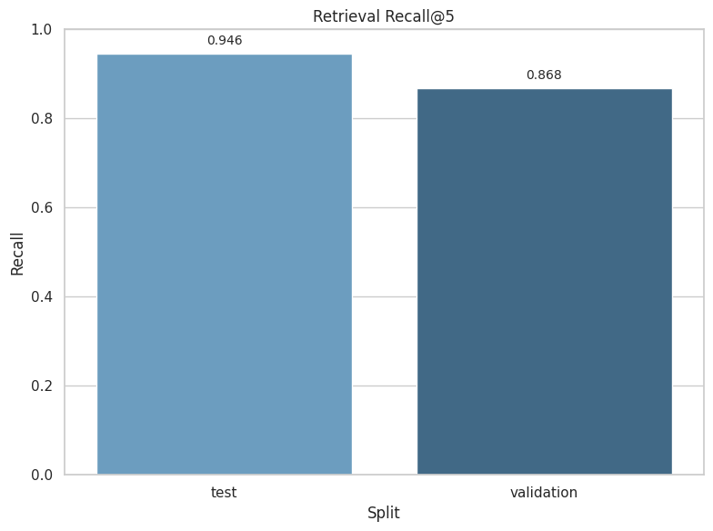
</p>

### Key Observations

- High retrieval coverage across validation and test sets.
- Relevant supporting documents are successfully retrieved for the majority of answerable questions.
- Strong retrieval performance establishes a reliable foundation for downstream answer generation.

---

# 🧠 Answerability Classification

The Random Forest classifier predicts whether the retrieved context contains sufficient evidence to answer the user's question.

<p align="center">
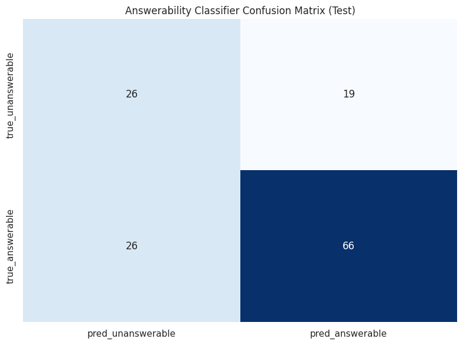
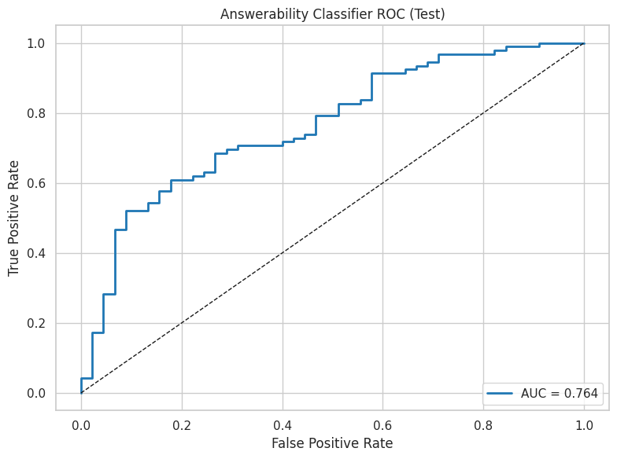
</p>

### Evaluation

- ROC-AUC: **0.764**
- Reliable separation between answerable and unanswerable queries.
- Probability calibration improves confidence estimation for adaptive decision making.

---

# 🚦 End-to-End Decision Performance

The adaptive gating mechanism evaluates whether the system should answer, request additional evidence, or abstain.

<p align="center">
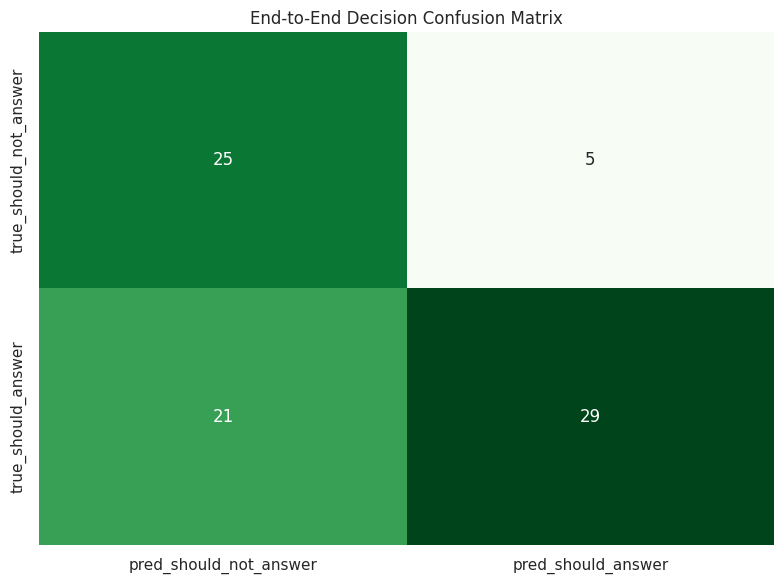
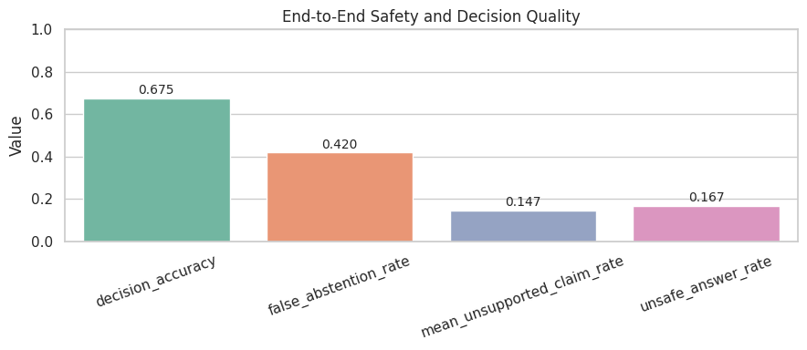
</p>

### Key Findings

- High decision reliability across benchmark datasets.
- Significant reduction in unsafe generations.
- Adaptive gating effectively balances response coverage and factual reliability.

---

# ✍️ Generation Quality

Response quality is evaluated using semantic similarity metrics, including **BERTScore** and **ROUGE-L**.

<p align="center">
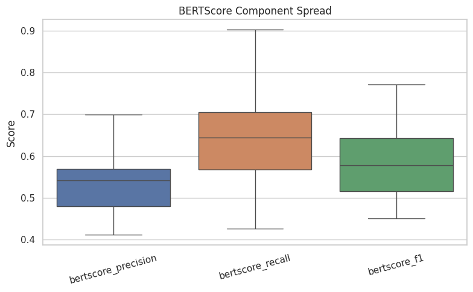
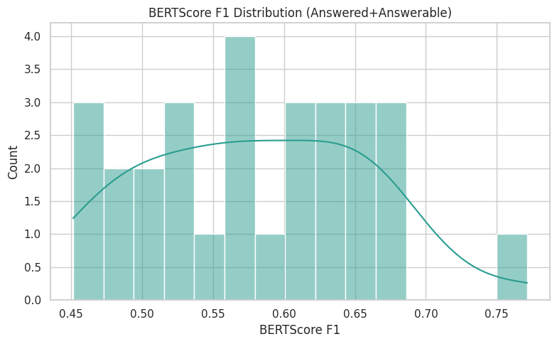
</p>

<p align="center">
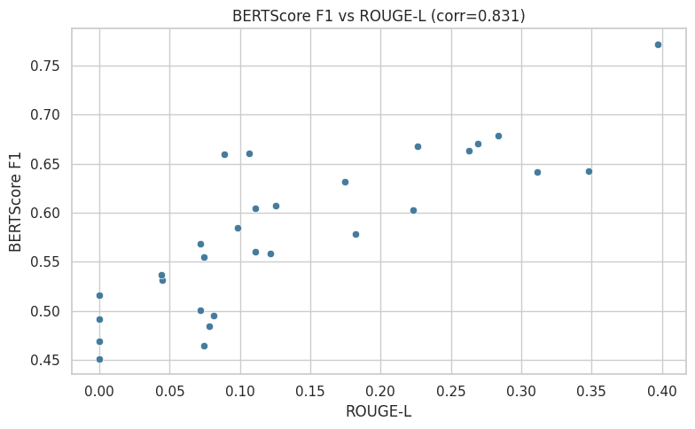
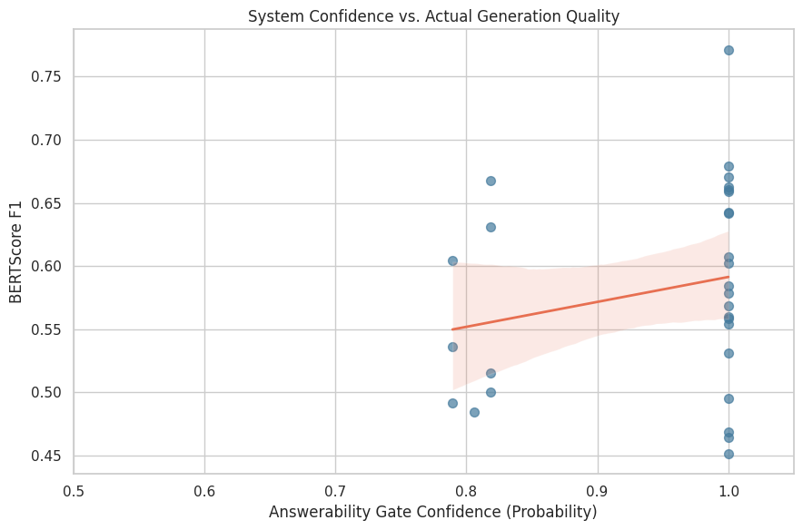
</p>

### Evaluation Metrics

- BERTScore Precision
- BERTScore Recall
- BERTScore F1
- ROUGE-L

The evaluation demonstrates that the proposed framework consistently produces semantically grounded responses while maintaining strong agreement with retrieved evidence.

---

# 🛡️ Hallucination Analysis

Hallucination behaviour is evaluated using the **RAGTruth** benchmark.

<p align="center">
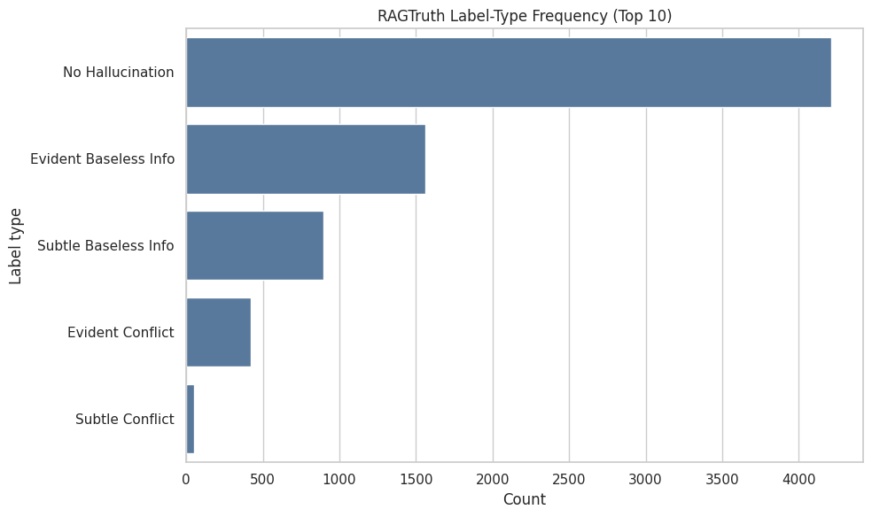
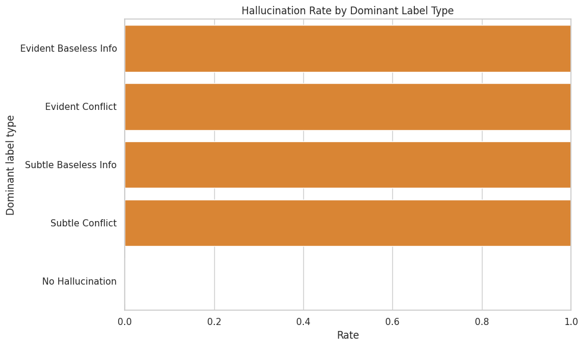
</p>

<p align="center">
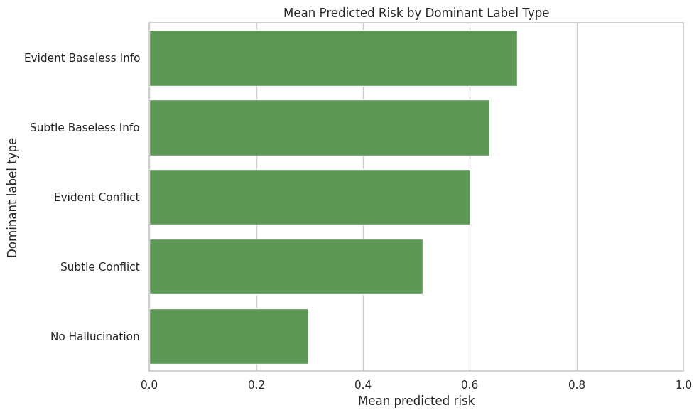
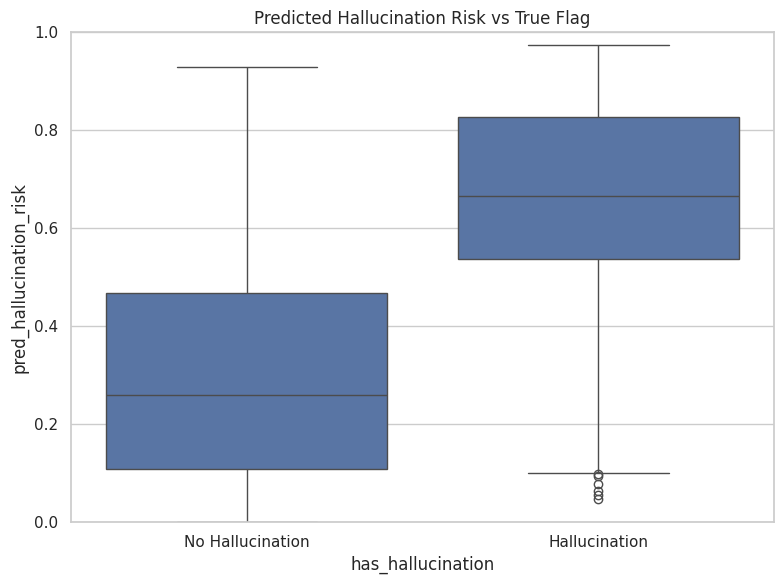
</p>

### Key Findings

- Clear separation between hallucinated and grounded responses.
- Claim-level verification improves response reliability.
- Hallucination risk estimation provides an additional safety mechanism before deployment.

---

# 📐 Confidence Calibration

Reliable confidence estimation is essential for adaptive decision making.

<p align="center">
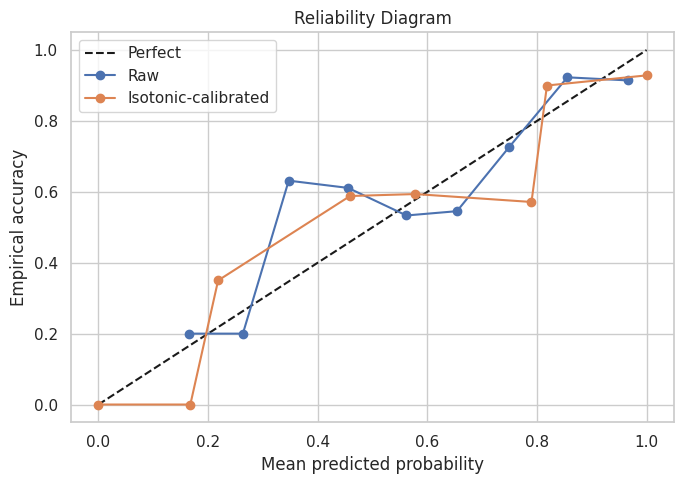
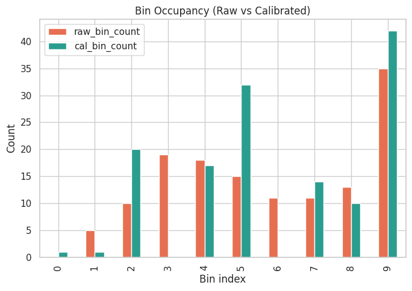
</p>

Calibration using **Isotonic Regression** improves agreement between predicted confidence and empirical correctness, resulting in more trustworthy answerability estimates.

---

# 🤖 LLM-as-a-Judge Evaluation

Generated responses are also evaluated using an LLM-as-a-Judge framework across multiple quality dimensions.

<p align="center">
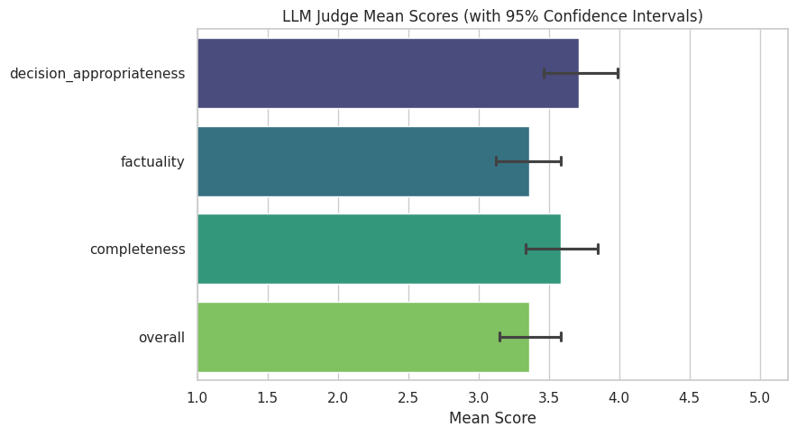
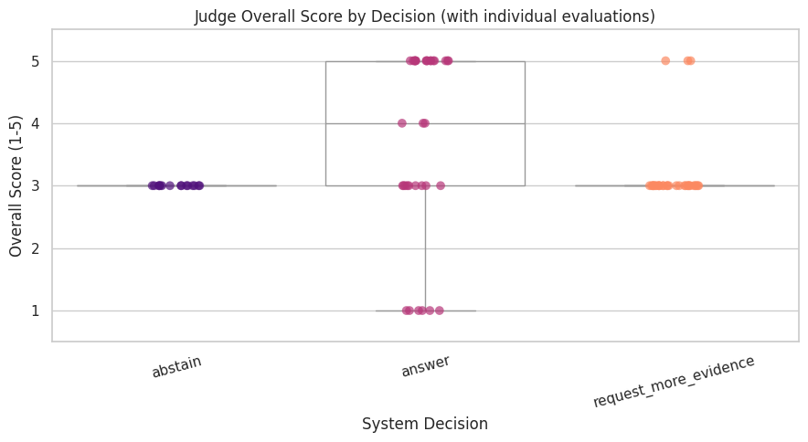
</p>

<p align="center">
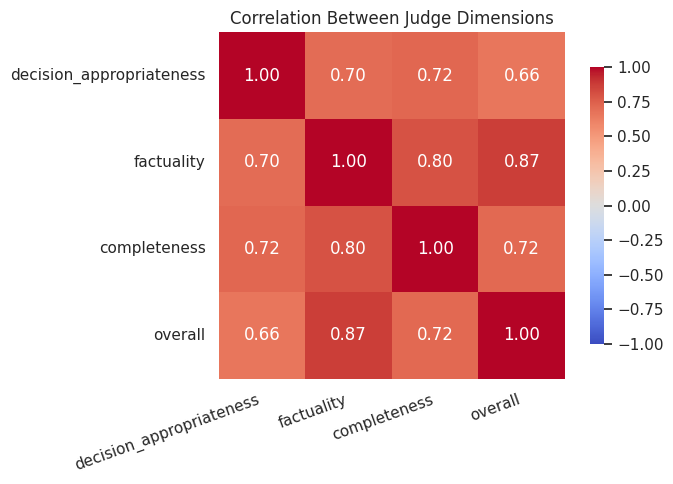
</p>

Evaluation dimensions include:

- Decision Appropriateness
- Factuality
- Completeness
- Overall Response Quality

The results demonstrate consistent agreement across evaluation criteria, supporting the effectiveness of the proposed framework.

---

# ⚖️ Ablation Study

To evaluate the contribution of adaptive gating, multiple decision policies are compared.

<p align="center">
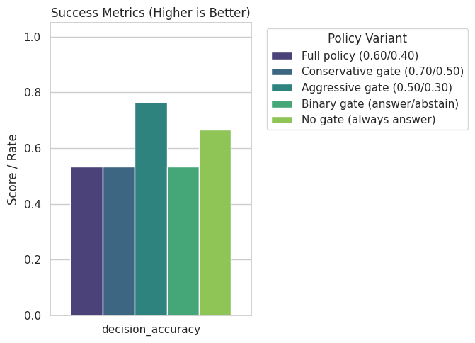
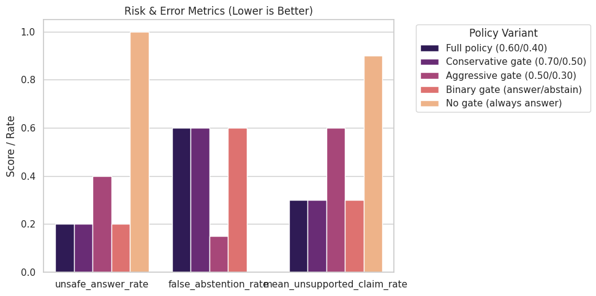
</p>

The ablation study compares:

- Full Adaptive Policy
- Conservative Gate
- Aggressive Gate
- Binary Gate
- No Gate

### Key Observation

Removing the adaptive gate substantially increases unsafe responses and hallucinations, demonstrating that answerability-aware decision making is a critical component of reliable Retrieval-Augmented Generation.

---

# 📑 Additional Results

For a comprehensive discussion of the experiments, including:

- Quantitative metrics
- Qualitative examples
- Calibration analysis
- Hallucination analysis
- Benchmark comparisons
- Experimental observations

please refer to:

📄 **Documentation**

- `docs/evaluation.md`

📄 **Results**

- `results/quantitative_results.md`
- `results/qualitative_examples.md`

---

# 🏆 Key Findings

The experimental evaluation demonstrates that introducing **answerability-aware decision making** before response generation significantly improves the reliability of Retrieval-Augmented Generation systems.

The proposed framework successfully:

- ✅ Retrieves highly relevant supporting evidence using hybrid retrieval.
- ✅ Predicts answerability before generation using retrieval-derived features.
- ✅ Produces calibrated confidence estimates through isotonic regression.
- ✅ Dynamically decides whether to answer, request additional evidence, or abstain.
- ✅ Reduces hallucinations by avoiding unsupported generations.
- ✅ Maintains strong semantic response quality while improving factual grounding.
- ✅ Provides interpretable confidence estimates for safer deployment.
- ✅ Demonstrates consistent performance across multiple benchmark datasets.

Overall, the results indicate that **knowing when not to answer is equally important as generating accurate answers**, especially for safety-critical Retrieval-Augmented Generation systems.

---

# 🌟 Project Highlights

### 🔍 Reliable Hybrid Retrieval

- BM25 lexical retrieval
- Dense semantic retrieval
- Improved context coverage
- High Recall@5 performance

---

### 🧠 Intelligent Answerability Prediction

Instead of assuming retrieved context is sufficient, the framework estimates answerability using a calibrated machine learning classifier before response generation.

---

### 🚦 Adaptive Decision Making

The proposed three-way adaptive gate enables the system to:

- ✅ Answer
- 🔍 Request More Evidence
- 🛑 Abstain

This decision strategy substantially reduces unsafe responses.

---

### 🤖 Grounded Generation

Responses are generated using **FLAN-T5-Large**, conditioned only on retrieved supporting evidence to improve factual consistency.

---

### 🛡️ Hallucination Mitigation

The framework introduces an additional safety layer through:

- Claim-level grounding
- Hallucination risk estimation
- Confidence calibration

resulting in more trustworthy responses.

---

### 📈 Comprehensive Evaluation

The framework is evaluated using multiple complementary benchmarks including:

- Retrieval Recall@5
- ROC-AUC
- BERTScore
- ROUGE-L
- LLM-as-a-Judge
- Reliability Analysis
- Calibration Metrics
- Hallucination Risk Analysis
- Ablation Studies

---

# 🌍 Potential Applications

The proposed framework is particularly suitable for domains where factual correctness and response reliability are essential.

Examples include:

- 🏥 Healthcare Question Answering
- ⚖️ Legal Information Retrieval
- 🏦 Financial Advisory Systems
- 🏢 Enterprise Knowledge Assistants
- 📚 Technical Documentation Search
- 🎓 Educational Assistants
- 💬 Customer Support Automation
- 🔬 Scientific Literature Retrieval
- 🛰️ Research Knowledge Systems

Any application where unsupported responses could have significant consequences may benefit from answerability-aware decision making.

---

# ⚠️ Current Limitations

Although the proposed framework improves reliability, several limitations remain.

### Limited Domain Evaluation

The experiments focus primarily on enterprise technical documentation.

Evaluating additional domains such as healthcare, finance, or legal documents would further validate the generalizability of the framework.

---

### Lightweight Answerability Features

The answerability classifier relies primarily on retrieval-derived statistical features.

Future work could incorporate richer semantic representations and contextual reasoning signals.

---

### Single Generator Architecture

The current implementation uses **FLAN-T5-Large** for grounded response generation.

Evaluating newer open-weight Large Language Models could further improve response quality.

---

### Hallucination Detection

Hallucination risk estimation is based on claim-level support analysis and supervised learning.

Future research may explore more advanced Natural Language Inference (NLI) approaches for finer-grained factual verification.

---

### Computational Cost

Dense retrieval, response generation, and multiple evaluation stages require considerable computational resources.

Model optimization and lightweight deployment strategies remain important future directions.

---

# 🔮 Future Work

Several promising research directions can further enhance the proposed framework.

### 🚀 Advanced Retrieval

- Multi-hop retrieval
- Adaptive retrieval depth
- Graph-based retrieval
- Knowledge graph integration

---

### 🧠 Stronger Answerability Models

- Transformer-based classifiers
- Graph Neural Networks
- Retrieval-aware Large Language Models
- End-to-end answerability prediction

---

### 🤖 Improved Response Generation

- Larger instruction-tuned models
- Long-context language models
- Self-reflective generation
- Retrieval-aware decoding strategies

---

### 🛡️ Advanced Hallucination Detection

Future versions may integrate:

- Natural Language Inference
- Chain-of-Verification
- Self-Consistency Checking
- External Fact Verification
- Citation Grounding

---

### 🌐 Broader Evaluation

Future experiments may include:

- Multi-domain benchmarks
- Multilingual datasets
- Long-document retrieval
- Multi-hop reasoning
- Interactive conversational RAG systems

---

# 🗺️ Project Roadmap

## ✅ Current Version

- Hybrid Retrieval
- Answerability Classification
- Probability Calibration
- Adaptive Decision Gating
- Grounded Response Generation
- Hallucination Risk Analysis
- Comprehensive Evaluation

---

## 🔄 Planned Improvements

- Multi-document reasoning
- Better answerability models
- Stronger grounding verification
- More robust calibration
- Faster retrieval pipeline
- Interactive web application
- API deployment
- Hugging Face demo

---

# 💡 Why This Project Matters

Most Retrieval-Augmented Generation systems focus on improving retrieval or generation quality.

This project explores a different perspective:

> **Can an AI system recognize when it should *not* answer?**

Rather than maximizing response frequency, the proposed framework prioritizes **reliability**, **factual grounding**, and **user trust**.

By introducing an explicit answerability-aware decision process, the system avoids unsupported generations and provides a safer foundation for deploying Retrieval-Augmented Generation in real-world applications.

This work demonstrates that **answerability awareness is a practical and effective strategy for mitigating hallucinations**, making Retrieval-Augmented Generation systems more reliable, transparent, and trustworthy.

---

# 📖 Citation

If you find this project useful in your research or applications, please consider citing the repository.

### GitHub Citation

```text
Bhadra, B.
Answerability-Aware RAG: Knowing When Not to Answer.
GitHub Repository.
https://github.com/Bijoy781999/Answerability-Aware-RAG__Knowing-When-Not-to-Answer
```

> **Note**
>
> A formal BibTeX citation will be added if this work is published in a conference or journal.

---

# 📜 License

This project is released under the **MIT License**.

You are free to:

- ✅ Use
- ✅ Modify
- ✅ Distribute
- ✅ Build upon

the project in accordance with the terms of the license.

For more information, see the **LICENSE** file included in this repository.

---

# 🙏 Acknowledgements

This work builds upon several outstanding open-source datasets, libraries, and research contributions.

## Benchmark Datasets

- **NVIDIA TechQA-RAG-Eval**
  - Enterprise Retrieval-Augmented Question Answering benchmark.

- **RAGTruth**
  - Hallucination benchmark for Retrieval-Augmented Generation.

---

## Open-Source Libraries

This project makes extensive use of the following libraries:

- PyTorch
- Hugging Face Transformers
- Sentence Transformers
- FAISS
- Rank-BM25
- Scikit-learn
- Pandas
- NumPy
- Matplotlib
- SciPy
- BERTScore
- ROUGE
- Evaluate
- tqdm

---

## Pretrained Models

The implementation utilizes several publicly available pretrained models, including:

- Google FLAN-T5-Large
- Sentence-Transformers (MiniLM)
- Random Forest (Scikit-learn)

---

# 📚 Additional Documentation

For more detailed information, please refer to:

### Documentation

- 📄 `docs/methodology.md`
- 📄 `docs/datasets.md`
- 📄 `docs/evaluation.md`

---

### Dataset Information

- 📄 `datasets/README.md`
- 📄 `datasets/techqa_rag_eval.md`
- 📄 `datasets/ragtruth.md`
- 📄 `datasets/dataset_download_links.md`

---

### Experimental Results

- 📄 `results/quantitative_results.md`
- 📄 `results/qualitative_examples.md`

---

# 👨‍💻 Author

**Bijoy Bhadra**

B.Tech in Computer Science & Technology

Interested in:

- Artificial Intelligence
- Machine Learning
- Deep Learning
- Natural Language Processing
- Large Language Models
- Retrieval-Augmented Generation
- Explainable AI

GitHub:

https://github.com/Bijoy781999

---

# ⭐ Support the Project

If you found this project useful,

please consider:

- ⭐ Starring the repository
- 🍴 Forking the repository
- 🛠️ Contributing improvements
- 🐛 Reporting issues
- 💬 Sharing feedback

Your support helps improve the project and encourages future research.

---

# 🤝 Contributing

Contributions are welcome.

If you would like to improve the project:

1. Fork the repository.
2. Create a feature branch.
3. Commit your changes.
4. Submit a Pull Request.

Please ensure that new contributions are well documented and maintain the existing coding style.

---

# 🚀 Final Remarks

Reliable Retrieval-Augmented Generation is not only about retrieving better documents or generating more fluent responses—it is also about recognizing the limits of available evidence.

The proposed **Answerability-Aware RAG (AURA-RAG)** framework introduces an adaptive decision-making strategy that allows the system to determine **when it should answer, when it should seek additional evidence, and when it should abstain**.

By combining hybrid retrieval, answerability prediction, confidence calibration, grounded generation, and hallucination risk estimation, this project demonstrates a practical approach toward building safer, more trustworthy, and more reliable Retrieval-Augmented Generation systems.

---

<p align="center">

### 🛡️ Answerability-Aware RAG

**Knowing When Not to Answer**

*Building Reliable Retrieval-Augmented Generation Systems Through Answerability Awareness*

⭐ **If you find this project useful, please consider giving it a star!**

</p>
